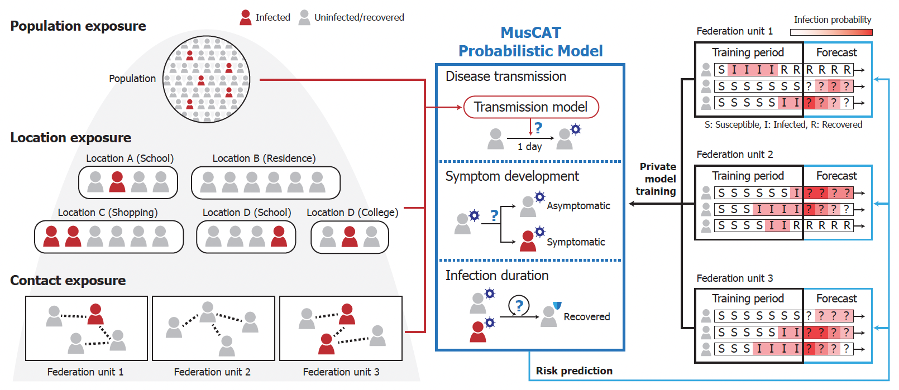

# MusCAT


This repository provides software for Team MusCAT's solution to the [U.S. PETs Prize Challenge](https://petsprizechallenges.com/) (Pandemic Forecasting). Team MusCAT won [first place](https://drivendata.co/blog/federated-learning-pets-prize-winners-phase1) for the white paper (Phase 1) and [second place](https://drivendata.co/blog/federated-learning-pets-prize-winners-phases-2-3) in the final stage (Phase 2) of the Challenge.

## Problem Setting

Predictive models that can assess individuals' daily infection risks can be a useful tool for pandemic response. Training these models at scale can be challenging due to difficulties in sharing personally identifying information across different data collection sites. The Challenge task was to develop a federated learning system that can jointly leverage distributed private datasets to train and apply risk prediction models with rigorous privacy protection. See [here](https://www.drivendata.org/competitions/103/nist-federated-learning-2-pandemic-forecasting-federated/) for the official Challenge page introducing the problem.

## Our Technical Approach

We introduce MusCAT, a multi-scale federated system for privacy-preserving pandemic risk prediction. We leverage the key insight that predictive information can be divided into components operating at different scales of the problem, including individual contacts, shared locations, and population-level risks. These components are individually learned using a combination of privacy-enhancing technologies to best optimize the tradeoff between privacy and model accuracy. Based on the Challenge dataset, we show that our solution enables improved risk prediction with formal privacy guarantees, while maintaining practical runtimes even with many federation units.



Our white paper describing the solution is available [here](https://www.dropbox.com/s/dzyc8himjtcu05j/PETsChallenge_MusCAT_Report.pdf?dl=0).

## Software Components and Methodology

Our solution is implemented in Python and Go.

- Centralized solution uses Python:

  - [solution_centralized.py](solution_centralized.py) represents the entrypoint to the solution. It defines the main functions required by the framework (`fit()` and `predict()`) and implements MusCAT's general workflow, similar to the one described in _Section 3.4 (Privacy-Preserving Federated System for Individual Risk Prediction)_ of our manuscript.

  - [muscat_model.py](muscat_model.py) constructs the MusCAT model and defines each step of MusCAT's workflow (called by [solution_centralized.py](solution_centralized.py)). See _Sections 3.4 and 5.1 (Centralized performance)_ for discussions of the workflow and its benchmarks.

- Federated solution uses both Python and Go. The latter is needed for cryptographic operations, and uses a [custom fork](https://github.com/hcholab/lattigo/tree/petschal) of [Lattigo](https://github.com/tuneinsight/lattigo) library for lattice-based homomorphic encryption, as discussed in _Section 5.2 (Federated Performance → Implementation Details)_.

  - [solution_federated.py](solution_federated.py) represents the entrypoint to the solution. It defines the main functions required by the framework (e.g., `fit()`, `configure_fit()`, ...) and implements MusCAT's general federated workflow.

    - `fit()` in class `TrainClient` implements the core of our model training, executed by the clients, with the computation of global statistics (**W0-W3** in _Section 3.4_) and the Poisson regression (**W4**).
    - `aggregate_fit()` in class `TrainStrategy` defines the operations of the server, i.e., securely aggregating encrypted information for the collaboration among the clients, as described in _Section 5 (Experimental Results)._
    - `fit()` and `evaluate()` in class `TestClient` implement the clients' part of the inference (**W6**)
    - `configure_fit()` and `aggregate_fit()` define the server functions for the same operations. See _Section 5._

  - [muscat_model.py](muscat_model.py) constructs the MusCAT model and defines each step of MusCAT's federated workflow (called by [solution_federated.py](solution_federated.py)), as described in _Section 3.4_.

  - [muscat_privacy.py](muscat_privacy.py) contains static parameters and functions specific for Differential Privacy (DP). See _Sections 3.4, 4 (Privacy Analysis → DP Training),_ and _5.2 (Federated Performance → Privacy)_ for a discussion of DP, its implementation and performance.

  - [dpmean.py](dpmean.py) provides `multivariate_mean_iterative()` that implements CoinPress algorithm for private mean estimation (called by [solution_federated.py](solution_federated.py)), as described in _section 5.2_ _(Federated Performance → Privacy)_.

  - [muscat_workflow.py](muscat_workflow.py) contains static parameters for
    the secure and plaintext training and testing workflows. It notably defines the training parameters and the order of the rounds to train a model. See _Section 3.4_ on the workflow.

  - [mhe_routines.go](mhe_routines.go) represents the Go entrypoint that
    parses command-line arguments passed to it from Python, and executes
    a computation corresponding to its step in the Python workflow.
    This takes the form:

    ```sh
    muscat <command> <arg1> [<arg2> ...]
    ```

    where `<command>` designates a step in the workflow,
    and `<arg1> [<arg2> ...]` represents various arguments, which
    specify either path(s) to the data directory(s), or numeric parameters. It currently enables the setup of the cryptographic parameters and the execution of the _Collective Aggregation and Decryption_ (used during MusCAT's workflow for secure aggregation of the clients' local results by the server), as discussed in _Sections 3.4 and 5_.

  - [mhe/crypto.go](mhe/crypto.go) contains cryptographic utilities
    for Multiparty Homomorphic Encryption (MHE, e.g., vectors encryption and decryption), along with some functions to handle disk I/O (e.g., to save and read cryptographic parameters and keys), which is needed for passing data from/to Python. See Section _5.2.1 (Efficiency & Scalability → MHE Operations)_ on the use of these cryptographic primitives.

  - [mhe/protocols.go](mhe/protocols.go) provides high-level functions
    that implement disk-assisted client-server communication protocol. See _Section 5.2.1 (Efficiency & Scalability)_ for this protocol implementation.

  - [mhe/utilities.go](mhe/utilities.go) contains auxiliary utilities,
    including functions to (de)serialize data vectors and matrices
    from/to disk, in order to pass them from/to Python. See _Section 5.2.1_ for relevant discussions.

  - [go.mod](go.mod) and [go.sum](go.sum) configure third-party Go
    dependencies.

## Usage

0. Make sure you're working on a machine with sufficient memory -
   64GB or more is recommended, but it will depend on the overall data size.
   On macOS, you may need to increase virtual machine memory
   in Docker Desktop settings.

1. Prepare a dataset. Sample data can be downloaded from
   https://net.science/files/resources/datasets/PET_Prize_PandemicForecasting/
   (e.g. `va_synthetic_population_and_outbreak_ver_1_9.zip`).

   After downloading and unpacking a dataset, prepare it according to
   [pandemic-partitioning-example.ipynb](pandemic-partitioning-example.ipynb)
   notebook.

2. Install Docker and run the following command:

   ```sh
   docker run --rm -it --pull always \
     -v "$(pwd)/data/pandemic":/code_execution/data:ro \
     -v "$(pwd)/submission":/code_execution/submission \
     ghcr.io/hhcho/muscat centralized # or federated
   ```

3. The tool output will be stored under `submission/` folder:

   ```
   centralized-test.log    centralized-train.log   log.txt
   cpu_metrics.csv.gz      memory_metrics.csv.gz   metrics.json
   process_metrics.log.gz  system_metrics.sar.gz
   predictions             scoring_payload         state
   ```

   Here, `predictions/<submission_type>/predictions.csv`
   provides results from a sucessful run:

   ```
   pid,score
   ...
   195155,0.83926135
   195156,0.8401405
   195157,0.8403996
   195158,0.0
   ...
   ```

   Similarly to `predictions_format.csv`, each row represents
   a person (with a numeric ID) and their risk score of
   getting infected during the test period, with a higher score
   corresponding to higher confidence that they become infected.

   If a run fails, you can use `log.txt` to troubleshoot it.

   `*metrics*` files contain various internal performance metrics.

   `scoring_payload` and `state` store internal state from a run.

## Development

When making changes to the code, you can rebuild the Docker image locally using

```sh
docker build --platform linux/amd64 -t ghcr.io/hhcho/muscat .
```

## Questions about software

- Denis Loginov, denis@broadinstitute.org
- Hoon Cho, hhcho@broadinstitute.org
